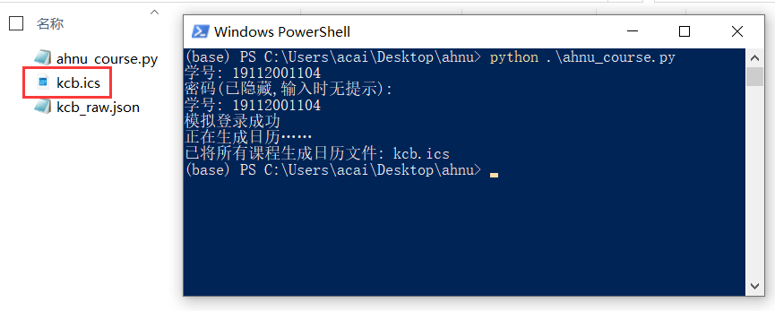

# curriculum_to_ics
安师大新教务系统课程表转日历文件，可在日历里显示课程表

### info
大学课程表一般都包含上课地址、时间等信息，完全可以用日历软件来做日程安排、上课提醒等，不再需要安装多余的课程表专用app
前段时间写了个爬虫程序，自动获取安师大教务系统课程表，并且转换为通用的日历格式文件，支持各种操作系统。

### 运行环境
- python3

### 安装依赖
```
pip install icalendar
```

### 运行
```
python ahnu_course.py
```


